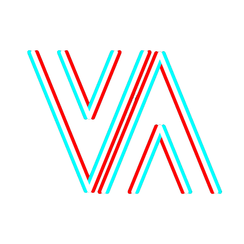

 

  

  
<h3 align="center">Mativated</h3>

This app is still (2025) hosted on pythonanywhere and working, however I am not working on it anymore.
It was a great playground, great struggle and a great lesson working on it for over 10 months, however I didn't realize how not scalable and messy using Django (not DRF) + HTMX can be.
I am proud I've made it all myself from scratch, but it's time to move forward. There is a lot of mess in this version, as I didn't have enough experience to plan it properly. 
Creating an app solo taught me Project Management, Problem-Solving, UI/UX Design, Time Management. 
Now using that experience I am remaking it with a better technology stack. [Remake](https://github.com/g4n3sha5/mativated-monorepo).

  
 
  

Non-commercial project for Martial Artists.
  As numerous studies have shown, monitoring your progress and tracking your habits make us significantly more prone to improve our behaviour and progress faster. Small wins are massive motivators, but we need to recognize them. This project provides utilities for people who love sport - grappling Martial Arts, this app is specifically created for Brazilian Jiu Jitsu.
  

# About
I created the project inspired by literature about habits and motivation, as Jiu-Jitsu is my passion and I didn't know any app for Jiu Jitsu I decided to create one - to save my Training Sessions, following this idea I did:

- Logo, name, colors and typography

- Landing page and general UI & UX design 

### And a set of small apps serving as tools for Martial Arts students:
#### Clubs
- Add / edit club
- Club Members (others' profiles, and permissions manager for authorized)
- Club Schedule (generator)
- Club Training Sessions (more info in About)
- Clubs List, where all users of MATIVATED can see every Club created, and ask (Request) authorized members of the Club to join it (permissions)

#### BJJorunal (Brazilian Jiu - Jitsu Journal)
- Dashboard (Statistics)
- Add Training Session (Save Session type, length, techniques learned etc.)
- Your Training Sessions (list of every TS, where user can edit or remove every Session)
- Open Techniques base (where every user can add a Jiu Jitsu Technique (name, type etc.) and add Suggestions to other Techniques)
- Simple To Do app where user can add a To Do list, and items to do for each list.

#### Notifications
- Notify authorized members about Requests 

#### Account / Profile
- Manage Account (change password / e-mail) and Profile (personal info (optional) - user's avatar, belt, bio, favourite technique and favourite grappler).

#### additional: About and Privacy policy
As the application processes some personal data, there is information how and what does it do.

# Technologies
Project made with Django, HTML, CSS, JavaScript, Bootstrap, HTMX, FontAwesome

# Run
Beta version live on https://m4tivated.eu.pythonanywhere.com/

(www.mativated.com)

### Locally
Clone the repo, install dependencies with 
  pip: -r requirements.txt
And run with 
  python manage.py runserver

### Built With

+ HTMX

# Future development
For year 2023/2024 the app is planned to be rebuild with React.

## Author

* **Kamil Matysiak** - [g4n3sha5](https://github.com/g4n3sha5)

## Acknowledgments
App inspired by:
* Atomic Habits by James Clear
* The Motivation Myth by Jeff Haden
* The Power of Habit by Charles Duhigg

* <a href="https://www.flaticon.com/free-icons/flexibility" title="flexibility icons">Flexibility icons created by Flat Icons - Flaticon</a>
<a href="https://www.flaticon.com/free-icons/judo" title="judo icons">Judo icons created by Vitaly Gorbachev - Flaticon</a>
* <a href="https://www.flaticon.com/free-icons/jiu-jitsu" title="jiu jitsu icons">Jiu jitsu icons created by Flat Icons - Flaticon</a>
* <a href="https://www.flaticon.com/free-icons/clock" title="clock icons">Clock icons created by Arkinasi - Flaticon</a>
* <a href="https://www.flaticon.com/free-icons/month" title="month icons">Month icons created by CreativeCons - Flaticon</a>
* <a href="https://www.flaticon.com/free-icons/plus" title="plus icons">Plus icons created by Freepik - Flaticon</a>
* <a href="https://www.flaticon.com/free-icons/gym" title="gym icons">Gym icons created by Freepik - Flaticon</a>
* <a href="https://www.flaticon.com/free-icons/calendar" title="calendar icons">Calendar icons created by Freepik - Flaticon</a>
* <a href="https://www.flaticon.com/free-icons/judo" title="judo icons">Judo icons created by photo3idea_studio - Flaticon</a>
